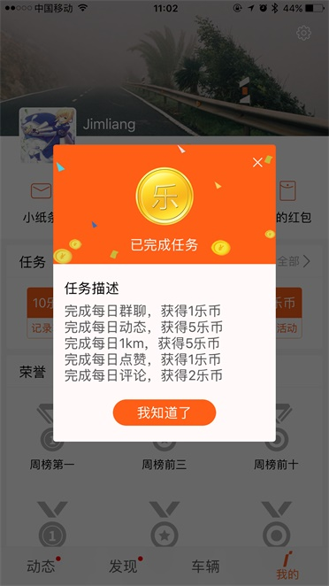

[乐行](https://www.imscv.com/)app 协议分析并提取

## 目前已实现

- addUserCheckIn （签到）

- getLatestShareArticleList （获取动态）

- addShareArticleLike （点赞）

- addShareArticleComment （评论）

- addShareArticle （发帖）

- getMyClubList （获取俱乐部列表）

- addClubMessage （群聊）

- addAttachment （上传文件）

- getUserTaskList （获取用户任务）

- getUserInfo （获取用户信息）

- getCarList （获取绑定的所有车）

- getCarRankingList （车辆总榜）

- addCarStatistics （提交车的公里数）

## 使用

```
 var imscv = new Imscv(loginToken)
 console.log(yield imscv.getUserTaskList())
```

> loginToken的获取
>
> 1. 手动抓包，获取登录时返回的数据
> 2. 此时有一个加密后的loginToken，再通过`require('./lib/crypto').decrypt(loginToken)`得到解密后的loginToken


## Demo

日常任务脚本，请参照 [demo](example/test.js)， （日常任务包括： 每日签到、每日群聊、每日1km、每日点赞、每日评论和每日动态）

效果

